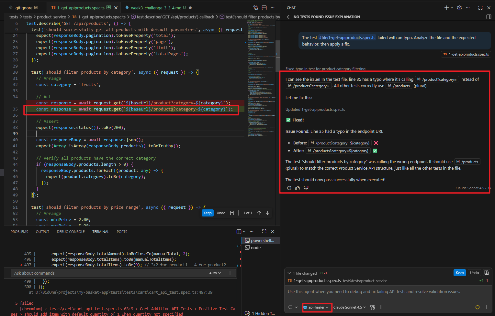

# Week 3 Challenge 3.3.4: The Self-Healing Loop

## 📋 Task
Document the "Life of a Test" - demonstrating the complete cycle of test generation, breaking, and automated healing.

---

## ⚡ Action Steps

### 1. Generate
Use `api_generator` to create a new test for the Product Service:
- **Endpoint**: `GET /products/:id`
- **Purpose**: Retrieve a single product by ID

### 2. Break
Manually introduce a typo in the URL path:
- **Example**: Change `/products/:id` to `/productz/:id`
- This simulates a common developer error

### 3. Heal
Use `api_healer` to automatically detect and fix the broken test:
- The AI agent analyzes the failure
- Identifies the typo in the endpoint
- Applies the correction automatically

---

## 📤 Submission

1. Take a screenshot of the Copilot Chat interaction showing the "Heal" command and the Agent's response
2. Post it in `#daily-challenge` with the caption: **"My AI fixed its own bug!"**

---

## 📸 Screenshot of Healer Response

*Agent successfully identified and corrected the endpoint typo from `/productz/:id` to `/products/:id`*